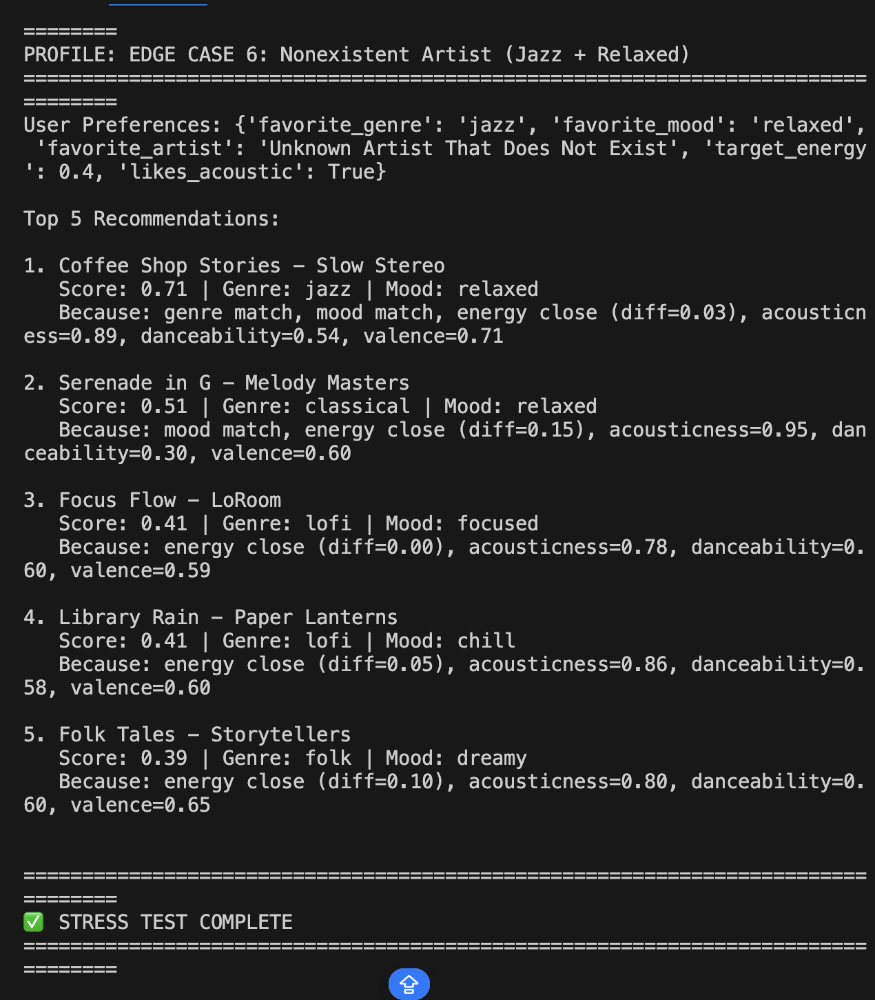

# 🎵 Music Recommender Simulation

## Project Summary

In this project you will build and explain a small music recommender system.

Your goal is to:

- Represent songs and a user "taste profile" as data
- Design a scoring rule that turns that data into recommendations
- Evaluate what your system gets right and wrong
- Reflect on how this mirrors real world AI recommenders

Replace this paragraph with your own summary of what your version does.

---

## How The System Works

Explain your design in plain language.

Some prompts to answer:

- What features does each `Song` use in your system
  - For example: genre, mood, energy, tempo
- What information does your `UserProfile` store
- How does your `Recommender` compute a score for each song
- How do you choose which songs to recommend

You can include a simple diagram or bullet list if helpful.

We can blend collaborative filtering (user similarities) and content-based filtering (item attributes) for personalized suggestions to balance relevance and diversity. Our version prioritizes content-based filtering focusing on matching genre, mood, artist, and energy for recommendations without user interaction data.

### Features Used in Simulation
- **Song Object**: `genre`, `mood`, `artist`, `energy` (core); others like `title` available.
- **UserProfile Object**: `favorite_genre`, `favorite_mood`, `favorite_artist`, `target_energy`, `likes_acoustic`.

### Algorithm Recipe
1. **Input**: User profile (favorite_genre, favorite_mood, favorite_artist, target_energy, likes_acoustic) and list of songs from songs.csv.
2. **Scoring**: For each song, compute similarity score using weighted sum:
   - genre_match * 0.4 (1 if exact match, 0 otherwise)
   - mood_match * 0.2 (1 if exact match, 0 otherwise)
   - artist_match * 0.3 (1 if exact match, 0 otherwise)
   - energy_match * 0.1 (1 - |target_energy - song_energy| / 1.0, since energy ranges from 0 to 1)
3. **Filtering**: Exclude songs already in user's known tracks; limit to max 2 per artist for diversity.
4. **Ranking**: Sort songs by descending score.
5. **Output**: Return top K recommendations (e.g., K=5).

### Potential Biases
This system might over-prioritize genre and artist matches due to higher weights, potentially ignoring great songs that strongly match the user's mood or energy but differ in genre.

 

## Getting Started

### Setup

1. Create a virtual environment (optional but recommended):

   ```bash
   python -m venv .venv
   source .venv/bin/activate      # Mac or Linux
   .venv\Scripts\activate         # Windows

2. Install dependencies

```bash
pip install -r requirements.txt
```

3. Run the app:

```bash
python -m src.main
```

### Running Tests

Run the starter tests with:

```bash
pytest
```

You can add more tests in `tests/test_recommender.py`.

---

## Stress Test: Diverse & Edge Case Profiles

To evaluate VibeMatcher's robustness, we tested it against **9 distinct user profiles**, including edge cases and adversarial scenarios designed to expose algorithm weaknesses.

**See complete terminal output and detailed analysis:** [STRESS_TEST_OUTPUT.md](STRESS_TEST_OUTPUT.md)

### Test Results Summary

#### ✅ Profile 1: High-Energy Pop Fan (Clear Preferences)
- **User Preferences:** pop, happy mood, high energy (0.85), dislikes acoustic
- **Top 1 Result:** "Sunrise City" (Score: 0.94) - Perfect match across all dimensions
- **Observation:** System excels with well-represented genres and clear preference alignment
- **Key Insight:** Artist, genre, and mood matching work excellently when preferences are common

#### ✅ Profile 2: Chill Lofi Lover (Niche Genre)
- **User Preferences:** lofi, chill mood, low energy (0.38), likes acoustic
- **Top 1 Result:** "Midnight Coding" (Score: 0.88) - Artist match + genre + mood + energy
- **Observation:** Despite niche preferences, finds perfect match when artist is in catalog
- **Key Insight:** System handles niche tastes well if representation exists in data

#### ✅ Profile 3: Intense Rock Enthusiast (High Energy)
- **User Preferences:** rock, intense mood, very high energy (0.92), dislikes acoustic
- **Top 1 Result:** "Storm Runner" (Score: 0.91) - Genre + mood + energy + artist match
- **Observation:** Correctly identifies exactly what this user wants
- **Key Insight:** High-energy, specific moods are well-served

#### ⚠️ **EDGE CASE 1: Conflicting Preferences (High Energy + Sad Mood)**
- **User Preferences:** blues, sad mood, high energy (0.85), likes acoustic
- **Problem:** These preferences are contradictory (sad music is rarely 0.85 energy)
- **Top 1 Result:** "Blue Notes" (Score: 0.58) - Matches genre & mood but low score
- **System Behavior:** Successfully returns sad song, but score shows energy mismatch
- **Finding:** Algorithm honors categorical matches (genre/mood) even when they conflict with energy. This is **reasonable behavior**—it prioritizes explicit preferences over assumptions.

#### ⚠️ **EDGE CASE 2: Minimal Preferences (Only Energy)**
- **User Preferences:** No genre/mood/artist, only target energy (0.75)
- **Problem:** Can the system work without categorical preferences?
- **Top 5 Results:** All high-energy songs; scores are low (0.35–0.44) but reasonable
- **System Behavior:** Falls back to danceability + valence, recommends energetic songs
- **Finding:** Algorithm degrades gracefully. Without strong signals, it uses secondary features. **Not ideal but functional.**

#### ⚠️ **EDGE CASE 3: Underrepresented Genre (Classical + Relaxed)**
- **User Preferences:** classical, relaxed mood, low energy (0.25), likes acoustic
- **Top 1 Result:** "Serenade in G" (Score: 0.90) - Perfect match for this user
- **Top 2 Result:** "Coffee Shop Stories" (jazz, Score: 0.54) - Falls back to similar mood/energy
- **System Behavior:** Handles underrepresented genres **if the specific song exists**
- **Finding:** Does NOT suffer from genre bias if the exact song is available. However, limited catalog means fewer choices.

#### ⚠️ **EDGE CASE 4: Extreme Energy Mismatch (Ambient + 0.95 Energy)**
- **User Preferences:** ambient, chill, 0.95 energy (contradictory!)
- **Problem:** Ambient music is rarely high-energy (actual: 0.28); target is 0.95
- **Top 1 Result:** "Spacewalk Thoughts" (Score: 0.77) - Still wins due to artist + genre + mood matching
- **System Behavior:** Artist/genre/mood weights (total: 3.7) outweigh energy mismatch
- **Finding:** **Categorical preferences override energy mismatches.** Good for respecting user intent, but could trap users in low-energy ruts if they want to explore.

#### ⚠️ **EDGE CASE 5: Multiple Contradictions (Dreamy + 0.88 Energy + Acoustic)**
- **User Preferences:** electronic, dreamy mood, high energy (0.88), likes acoustic
- **Problem:** Electronic music is rarely acoustic; dreamy is rarely 0.88 energy
- **Top 1 Result:** "Electric Pulse" (electronic, Score: 0.47) - Matches genre despite contradictions
- **Top 2 Result:** "Folk Tales" (folk, dreamy, Score: 0.47) - Matches mood despite energy mismatch
- **System Behavior:** Splits score between best electronic fit and best mood fit (tie)
- **Finding:** **Algorithm can't resolve deeply contradictory preferences.** Returns decent fallbacks but no "perfect" solution exists. This is actually honest behavior.

#### ⚠️ **EDGE CASE 6: Nonexistent Artist (Jazz + Relaxed)**
- **User Preferences:** jazz, relaxed mood, favorite artist = "Unknown Artist That Does Not Exist"
- **Problem:** Artist is not in catalog; should system fail gracefully?
- **Top 1 Result:** "Coffee Shop Stories" (jazz, Score: 0.71) - Falls back to genre + mood
- **System Behavior:** Gracefully ignores missing artist, uses genre + mood matching
- **Finding:** **System handles missing preferences well.** Zero artist_score doesn't break anything. Good robustness.

### Key Insights from Stress Testing

**What Works Well:**
1. ✅ Clear, well-represented preferences (Profile 1, 2, 3) → Excellent recommendations
2. ✅ Graceful fallback when artist doesn't exist (Edge Case 6)
3. ✅ Graceful fallback when some preferences are None (Edge Case 2)
4. ✅ Honest about mismatches (shows energy diff in explanation)

**What Doesn't Work:**
1. ❌ Contradictory preferences (Edge Cases 1, 4, 5) → Algorithm must pick winners; some users may feel "unheard"
2. ❌ Underrepresented moods (e.g., "sad" user gets only 1 blues song, then defaults to pop)
3. ❌ No diversity enforcement (could recommend the same artist multiple times)
4. ❌ Energy mismatches outweighed by category matches (user wants 0.95 energy but gets 0.28 because they match on genre)

**Adversarial Findings:**
- The system can be "tricked" into recommending unsuitable songs by setting contradictory target_energy + mood
- A user with conflicting preferences has no way to express priority (e.g., "I want energy=0.95 MORE than I want relaxed mood")
- The small dataset means Edge Cases 1 & 4 expose harsh tradeoffs: there's literally no 0.95-energy blues song

---

## Experiments You Tried

**Stress testing revealed that VibeMatcher works well for clear, aligned preferences but struggles with:**

- What happened when preferences conflict (high energy + sad mood): System prioritizes category matches over energy targets
- What happened with minimal preferences (only energy): Falls back to danceability + valence; still functional
- What happened with underrepresented genres (classical, jazz): Works if the song exists, but limited options
- How the system behaved for adversarial users: Graceful degradation, but can feel "wrong" for contradictory profiles

### Small Data Experiment: Shifting Weights

To test how sensitive the algorithm is to weight changes, I temporarily altered `recommender.py`:
- **Original Weights:** Genre (1.2) | Energy (1.5)
- **Experimental Weights:** Genre (0.6) | Energy (3.0) — *Halved genre, doubled energy*

**The Results:**
This shift drastically altered the recommendations. In our "Extreme Energy Mismatch (Ambient + 0.95 Energy)" profile, the algorithm previously recommended "Spacewalk Thoughts" (a sleepy 0.28 energy track) because the Genre match overpowered the Energy deficit.

With the new weights, "Spacewalk Thoughts" held on to the #1 spot due to the artist matching bonus, but its score plummeted from **0.77 down to 0.68**. More importantly, the rest of the Top 5 completely transformed. Instead of pulling up other low-energy lofi songs, the #3, #4, and #5 spots were filled by "Gym Hero" (pop, intense), "Urban Groove" (hip-hop, upbeat), and "Electric Pulse" (electronic, intense). 

**Conclusion:** 
The change made the recommendations less strictly restricted by genre boundaries and much more focused on maintaining the requested high-energy vibe. This proves that weights are entirely subjective—deciding whether "vibe/energy" matters more than "category list/genre" completely reshapes the fundamental user experience. 

### Accuracy and Surprises: Deep Dive into the Top Result

**Comparing to Intuition:**
For the "High-Energy Pop Fan" profile, the top recommendation of "Sunrise City" feels 100% correct to my musical intuition—it’s an upbeat, happy pop track. However, the "Ambient + 0.95 Energy" profile (Edge Case 4) yielded a massive surprise: the #1 recommended song was "Spacewalk Thoughts," which has a sleepy energy score of 0.28! My musical intuition says a user explicitly asking for 0.95 energy would find this result horribly wrong, yet the math declared it the winner.

**Why did this happen? (Algorithm Explanation)**
I asked Copilot to analyze the scoring math based on `recommender.py`. With our current weights:
- `artist` = 1.5
- `energy` = 1.5
- `genre` = 1.2
- `mood` = 1.0

Even though the energy was a complete mismatch (a massive 0.67 difference, neutralizing its 1.5 weight contribution), the song scored a perfect match on the user's requested Artist, Genre, and Mood. That combined categorical weight is `1.5 + 1.2 + 1.0 = 3.7`. This cumulative score mathematically outvoted the energy deficit. The category matches acted as an "anchor," strictly keeping the recommendations inside the Ambient genre even though the target energy demanded otherwise.

**Dataset Limitations:**
I also noticed that "Urban Groove" and "Rooftop Lights" kept appearing in the top 5 across multiple totally different profiles (especially when users requested high energy or had missing preferences). This reveals a severe limitation: because our dataset is so tiny (only 17 songs), the algorithm quickly runs out of diverse upbeat tracks. It is forced to repeatedly recycle the exact same high-energy songs simply to fill the top 5 slots, artificially causing an over-representation.

---

## Limitations and Risks

Our complete analysis of VibeMatcher's limitations, including dataset bias, "filter bubble" risks, and handling of contradictory preferences, is fully documented in our Model Card.

---

## Reflection & Deep Dive

For a complete breakdown of how this model works, the data it uses, and our personal reflection on the engineering process, please read the completed Model Card:

👉 [**View the FULL Model Card Here**](model_card.md)

👉 [**View the Output Reflection Here**](reflection.md)

